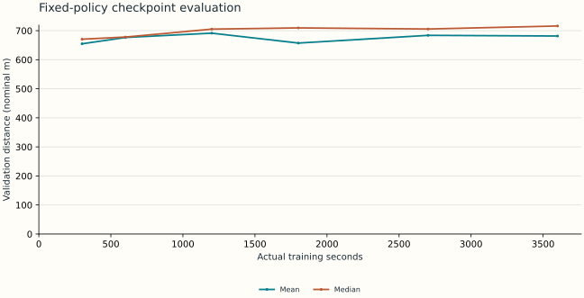

# GradientClimb research report

**Status: Cycle 1 paused; real-game qualification incomplete.**

## Abstract and research status

GradientClimb measures how control quality changes with training time, experience, compute and prior knowledge. The current evidence establishes learning in an original uncalibrated simulator. Real-game qualification remains incomplete. The selected one-hour record is c0a9e142-1ad6-4d88-810d-bda4ca297f40 (completed).

## Cycle 1 pause and evidence cutoff

Research is paused by explicit user direction. All 23 registered post-hour actions completed, including 15 learning runs: 5,520 requested training seconds and 5,523.329 actual training seconds. This total excludes the original hour and separate runtime pilots; process setup and offline evaluation have separate records. No queued experiment is authorized to start. Canonical evidence ends at 2026-09-11T20:01:46.950554+00:00; report generation is a later read-only analysis. Source: research/experiments/cycle-1-plan-status.json. Historical preregistrations retain their original wording; the separate status record governs their terminal cycle disposition.

## Registered plan disposition

| Plan | Cycle status | Execution status | Interpretation |
| --- | --- | --- | --- |
| experiments/definitions/one-hour-surrogate.json | COMPLETED | COMPLETED | Original uncalibrated surrogate hour. Six scheduled offline evaluations and independent reproduction also complete. |
| experiments/definitions/post-hour-battery.json | COMPLETED | COMPLETED | All 23 sequential actions and 15 learning runs finalized; outcomes listed below. No remaining dispatch. |
| experiments/definitions/ablations.json | DEFERRED | NEVER_STARTED | Original 300-second seeds 10/11/12 protocol unexecuted; completed 60-second seeds 101/102/103 screen is distinct. |
| experiments/definitions/adaptation-pending.json | DEFERRED | NEVER_STARTED | Original replicated 5/10/30/60-minute protocol unexecuted. Completed single-seed 10-minute fine-tuning does not satisfy this protocol or establish a broadly pretrained generalist. |
| experiments/definitions/real-screen-cem.json | PARTIAL | PILOT_FAILED_HOUR_NEVER_STARTED | Shortened integration pilot failed on unrecognized advertisement during parking; zero eligible episodes and optimizer updates. Stable terminal 289 m is diagnostic; training fitness null. Governed native hour never started. |
| artifacts/distillation/proposed-screen-body-student.json | DEFERRED | NEVER_STARTED | Implementation and pure tests exist. Queued 60-second seed500 pilot cancelled before dispatch by user pause. No learned student, teacher-agreement measurement, simulator-performance measurement or native student evaluation. |

## Completed primary observation

Run c0a9e142-1ad6-4d88-810d-bda4ca297f40 trained for an actual 3,600.322 seconds and collected 41,648,128 transitions. Its recorded final validation mean was 681.55 nominal m and median 716.12 nominal m across 20 episodes. This is one independent training seed, followed by conditional episode evaluation. Measured checkpoint means were not monotonic; a later policy did not outperform every earlier policy on this validation set.

## Provisional surrogate trainer

PPO on CPU with 256 environments is the provisional choice from the replicated runtime screen. It had higher observed average validation distance and lower between-training-seed variability than the implemented CEM comparator. The table below retains all conditions and source runs. Three training seeds do not establish broad algorithm superiority, and this choice does not select a qualified real-game model.

## Experimental environment and methods

Hill Climb Racing is the first intended real testbed. Simulator metres are nominal surrogate units. The two-contact vehicle surrogate models suspension, traction, braking/reverse, airborne pitch, fuel and termination. Four joint pedal states 00/10/01/11 remain available. PPO uses independent Bernoulli pedals and a 24-feature, four-frame stacked MLP by default (96→64→64; 10,563 actor/critic parameters). CEM searches a 100-parameter linear joint-state controller on two fixed training seeds. Source: src/gradientclimb/simulation/hill.py and src/gradientclimb/algorithms/. No proprietary dynamics or game assets are redistributed.

## Training clock and statistical protocol

Actual monotonic training time includes environment/model/optimizer initialization, collection, updates, logging and checkpoint callbacks. Python imports/provenance setup and offline evaluation are outside that clock. Final serialization can create a small recorded overshoot. Validation episodes use seeds 10000–10019 in the runtime screen. Between-seed SD is computed across independently trained policies; episode bootstrap intervals condition on one policy and cannot substitute for training replicates. Model/runtime selection used validation results, so these are not untouched final-test results. Cold starts and runs with parent weights remain separate.

## Recorded workstation

Detailed machine inventory: docs/operations/workstation.md. Device capability alone is not evidence of faster learning.

| Field | Value |
| --- | --- |
| CPU | Intel64 Family 6 Model 183 Stepping 1, GenuineIntel |
| Physical / logical cores | 24 / 32 |
| RAM GiB | 63.71 |
| GPU | NVIDIA GeForce RTX 4090 Laptop GPU |
| Python | 3.13.5 |
| Frameworks | {"duckdb": "1.5.5", "gradientclimb": "0.1.0a1", "gymnasium": "1.3.0", "numpy": "2.5.3", "psutil": "7.2.2", "pyarrow": "25.0.1", "pydantic": "2.13.5", "torch": "2.11.0+cu128"} |

## Runtime and algorithm pilots

Exploratory 60-second budgets. Three seeds support a provisional engineering choice, not a broad superiority claim. CPU64 and CUDA256 each have one runtime-screen seed.

| Condition | Seeds | Mean distance m | Seed SD m | Transitions/s | Source runs |
| --- | --- | --- | --- | --- | --- |
| cem / cpu / 64 envs | 2, 1, 0 | 378.49 | 106.31 | 19,713 | 52a9a3cd-a16e-440a-ae13-e1d04bae1997, bddaf26c-ef4a-43fb-bfe6-d96e59a162f2, 57580930-1056-4baa-99ab-959a781fd1a0 |
| ppo / cpu / 256 envs | 2, 1, 0 | 491.38 | 35.08 | 8,523 | 1f36377e-af40-41ec-b075-25aa6612be04, 8352319c-e6e7-499d-b2d0-de43f90dafe2, 36a4fdb2-4c30-47a8-a980-0f3a302a20fa |
| ppo / cuda / 256 envs | 0 | 500.34 | not yet measured | 5,771 | 73404182-aee7-4618-b45d-3b9dddad30c2 |
| ppo / cpu / 64 envs | 0 | 499.95 | not yet measured | 5,149 | d49e26ca-4389-4321-88f8-8e0fac21e585 |

## Development/search compute

Runtime-screen requested budgets total 480.0 s; actual recorded training clocks total 481.36 s. These are prior development/search costs, not part of the governed one-hour cold-start session. Baseline evaluation, lightweight reporting and screenshot labeling occurred on the shared workstation during the main session; concurrent activity and thermal state limit causal hardware comparisons.

## One-hour scheduled checkpoint measurements

Scheduled rows require a matching declared parent run and checkpoint evaluation. Missing measurements stay missing. A final checkpoint score is never copied into an earlier time point. These results, when present, concern the surrogate and do not qualify real-game competence.

| Requested min | Actual training s | Mean m | Median m | Best m | Status | Evaluation run / checkpoint SHA-256 |
| --- | --- | --- | --- | --- | --- | --- |
| 5 | 300.06 | 654.78 | 670.61 | 780.31 | measured in uncalibrated simulator | b8df5a43-deb0-4b3a-917b-2398322c327c / 43576827225322ccffbf2d73c47e40f11c6951ac50f98ba8b2d0d1607962d334 |
| 10 | 601.03 | 676.58 | 678.06 | 807.15 | measured in uncalibrated simulator | b8df5a43-deb0-4b3a-917b-2398322c327c / f3bcc869e1f0ba8f7c5c3c097daf73c97860dd04c22a58cd1c96568312772662 |
| 20 | 1,200.22 | 691.37 | 705.24 | 836.86 | measured in uncalibrated simulator | b8df5a43-deb0-4b3a-917b-2398322c327c / 44d6aae8de3e8fb3f0e5793850655d7db35609a1ce4c1939d87c318ac090c85b |
| 30 | 1,801.19 | 657.34 | 709.48 | 829.80 | measured in uncalibrated simulator | b8df5a43-deb0-4b3a-917b-2398322c327c / 17566b111635e9cd73aa76bf39ff54666906a670f8a4359792fb6882e9edd02f |
| 45 | 2,701.38 | 683.84 | 705.67 | 823.91 | measured in uncalibrated simulator | b8df5a43-deb0-4b3a-917b-2398322c327c / 6cb2ec10f0886213f0dcc93f7f3bd832eb38082c86a2e64b17af4a12803a5e1b |
| 60 | 3,600.00 | 681.55 | 716.12 | 834.98 | measured in uncalibrated simulator | b8df5a43-deb0-4b3a-917b-2398322c327c / 94ebe80f4682e0a930f1aaec2ed85b0bc8d49ff4ea54dbc8b04c1cbd8a5e0dda |

## Learning curves

The plotted rolling mean covers the last 100 completed training episodes collected by changing stochastic policies. It is a training diagnostic, distinct from fixed-policy offline checkpoint evaluation. The source metric is mean_episode_distance, with training_elapsed_seconds from each canonical metric row.

## Training diagnostics

## Measured checkpoint quality

Each point uses the saved policy at its recorded actual training time and the same 20 validation seeds. Mean and median describe episode variation for one trained policy; these six time points are not six independent training replicates. No point is interpolated from a final evaluation.

## Observed efficiency frontier

The plot compares completed cold-start policies by actual training duration and validation quality. Experience counts remain separately inspectable in the JSON snapshot. The observed nondominated set minimizes time and transitions while maximizing mean distance; it ignores uncertainty and is descriptive, not a statistically established frontier. Parent-weight adaptation and extended runs are excluded from this cold-start comparison.

## Quality versus training time

## Simulator throughput

Includes environment stepping and random action generation; excludes policy inference and optimization. Each condition follows 10 warm-up steps. Source runs: 3d4dc35e-25c1-4671-8e8b-5c9bb150ac6c

## Recorded simulator baselines

Random and always-gas policies are explicit baselines. Discovery-only real-game observations are excluded.

| Baseline | Run | Mean m | Median m | Episodes | Protocol |
| --- | --- | --- | --- | --- | --- |
| always_gas | 5235fad7-9d8f-4713-bb8b-1a58029020dd | 35.37 | 35.45 | 20 | held-out-surrogate-test-0.1 |
| random | f015c7ca-d1bd-4c8a-bfa9-1a4c2c8877c5 | 29.18 | 20.89 | 20 | held-out-surrogate-test-0.1 |

## Vehicle/map generalization

Not yet measured when no rows are present. Synthetic heavy/rough shifts do not establish generalization to commercial-game vehicles/maps.

| Condition | Profile / terrain | Mean m | Median m | Source run | Checkpoint hash |
| --- | --- | --- | --- | --- | --- |
| in_distribution | default / train | 597.72 | 644.09 | 59768cd6-6640-4e20-8198-0158e7eb108c | 50b1010efc2acfb78d254bad87a8d80bc29d85ac29757ea6c50d9df8ce13be9b |
| new_map | default / rough | 339.68 | 377.60 | 59768cd6-6640-4e20-8198-0158e7eb108c | 50b1010efc2acfb78d254bad87a8d80bc29d85ac29757ea6c50d9df8ce13be9b |
| new_vehicle | heavy / train | 605.36 | 653.92 | 59768cd6-6640-4e20-8198-0158e7eb108c | 50b1010efc2acfb78d254bad87a8d80bc29d85ac29757ea6c50d9df8ce13be9b |
| new_vehicle_and_map | heavy / rough | 405.01 | 389.54 | 59768cd6-6640-4e20-8198-0158e7eb108c | 50b1010efc2acfb78d254bad87a8d80bc29d85ac29757ea6c50d9df8ce13be9b |
| in_distribution | default / train | 688.65 | 701.28 | 44ad7e2e-6758-4957-aa21-1d953d807bd7 | 8fbd187a6925de30f72ae47b6a0080301f39e18fc2e68cce1f491d1f141a2881 |
| new_map | default / rough | 66.90 | 47.08 | 44ad7e2e-6758-4957-aa21-1d953d807bd7 | 8fbd187a6925de30f72ae47b6a0080301f39e18fc2e68cce1f491d1f141a2881 |
| new_vehicle | heavy / train | 678.18 | 678.60 | 44ad7e2e-6758-4957-aa21-1d953d807bd7 | 8fbd187a6925de30f72ae47b6a0080301f39e18fc2e68cce1f491d1f141a2881 |
| new_vehicle_and_map | heavy / rough | 142.69 | 140.37 | 44ad7e2e-6758-4957-aa21-1d953d807bd7 | 8fbd187a6925de30f72ae47b6a0080301f39e18fc2e68cce1f491d1f141a2881 |
| in_distribution | default / train | 670.28 | 700.55 | c0a9db18-1344-4f74-b5ba-3e59d81b14ab | f9ba71dc136529518c9ade34a51f1d58a3650d5b7a3c918f6994c049148cb41d |
| new_map | default / rough | 44.51 | 43.51 | c0a9db18-1344-4f74-b5ba-3e59d81b14ab | f9ba71dc136529518c9ade34a51f1d58a3650d5b7a3c918f6994c049148cb41d |
| new_vehicle | heavy / train | 677.53 | 687.95 | c0a9db18-1344-4f74-b5ba-3e59d81b14ab | f9ba71dc136529518c9ade34a51f1d58a3650d5b7a3c918f6994c049148cb41d |
| new_vehicle_and_map | heavy / rough | 110.94 | 78.38 | c0a9db18-1344-4f74-b5ba-3e59d81b14ab | f9ba71dc136529518c9ade34a51f1d58a3650d5b7a3c918f6994c049148cb41d |
| in_distribution | default / train | 700.75 | 703.66 | 3a9a0c20-e544-4efd-9c68-e2830d8e8224 | 87c469539110d3134c04ebcf11e95f9c84e595c90ba7e6b2b106917115e04ec0 |
| new_map | default / rough | 122.30 | 97.29 | 3a9a0c20-e544-4efd-9c68-e2830d8e8224 | 87c469539110d3134c04ebcf11e95f9c84e595c90ba7e6b2b106917115e04ec0 |
| new_vehicle | heavy / train | 681.62 | 698.89 | 3a9a0c20-e544-4efd-9c68-e2830d8e8224 | 87c469539110d3134c04ebcf11e95f9c84e595c90ba7e6b2b106917115e04ec0 |
| new_vehicle_and_map | heavy / rough | 146.88 | 108.79 | 3a9a0c20-e544-4efd-9c68-e2830d8e8224 | 87c469539110d3134c04ebcf11e95f9c84e595c90ba7e6b2b106917115e04ec0 |

## Generalization outcomes and pedal use

Time-limit truncation is the fixed 60-second evaluation horizon, not proof of indefinite survival. Counts cover recorded policy decisions during the selected episodes. They establish which joint states were used in the simulator; they do not establish the causal value of each state or real-game input acknowledgement.

| Evaluation run / condition | Termination fractions | Mean survival s | Joint pedal counts 00 / 10 / 01 / 11 |
| --- | --- | --- | --- |
| 59768cd6-6640-4e20-8198-0158e7eb108c / in_distribution | crash: 15.0%, time_limit: 85.0% | 54.73 | 848 / 12007 / 3536 / 1851 |
| 59768cd6-6640-4e20-8198-0158e7eb108c / new_map | crash: 25.0%, time_limit: 75.0% | 51.38 | 1009 / 10597 / 3889 / 1631 |
| 59768cd6-6640-4e20-8198-0158e7eb108c / new_vehicle | crash: 15.0%, time_limit: 85.0% | 54.68 | 823 / 12435 / 3114 / 1856 |
| 59768cd6-6640-4e20-8198-0158e7eb108c / new_vehicle_and_map | time_limit: 100.0% | 60.00 | 1105 / 12895 / 4091 / 1909 |
| 44ad7e2e-6758-4957-aa21-1d953d807bd7 / in_distribution | crash: 10.0%, time_limit: 90.0% | 59.02 | 1660 / 14070 / 2845 / 1100 |
| 44ad7e2e-6758-4957-aa21-1d953d807bd7 / new_map | crash: 95.0%, stalled: 5.0% | 11.53 | 166 / 2653 / 772 / 253 |
| 44ad7e2e-6758-4957-aa21-1d953d807bd7 / new_vehicle | time_limit: 100.0% | 60.00 | 1309 / 15663 / 2109 / 919 |
| 44ad7e2e-6758-4957-aa21-1d953d807bd7 / new_vehicle_and_map | crash: 70.0%, stalled: 25.0%, time_limit: 5.0% | 27.73 | 622 / 6583 / 1607 / 432 |
| c0a9db18-1344-4f74-b5ba-3e59d81b14ab / in_distribution | crash: 5.0%, time_limit: 95.0% | 57.44 | 2342 / 13959 / 2794 / 53 |
| c0a9db18-1344-4f74-b5ba-3e59d81b14ab / new_map | crash: 100.0% | 7.13 | 60 / 1698 / 512 / 106 |
| c0a9db18-1344-4f74-b5ba-3e59d81b14ab / new_vehicle | time_limit: 100.0% | 60.00 | 1832 / 15976 / 2148 / 44 |
| c0a9db18-1344-4f74-b5ba-3e59d81b14ab / new_vehicle_and_map | crash: 75.0%, stalled: 20.0%, time_limit: 5.0% | 21.77 | 121 / 5198 / 1398 / 539 |
| 3a9a0c20-e544-4efd-9c68-e2830d8e8224 / in_distribution | time_limit: 100.0% | 60.00 | 1386 / 14470 / 3268 / 876 |
| 3a9a0c20-e544-4efd-9c68-e2830d8e8224 / new_map | crash: 90.0%, stalled: 5.0%, time_limit: 5.0% | 19.38 | 358 / 4299 / 1136 / 667 |
| 3a9a0c20-e544-4efd-9c68-e2830d8e8224 / new_vehicle | time_limit: 100.0% | 60.00 | 987 / 15905 / 2426 / 682 |
| 3a9a0c20-e544-4efd-9c68-e2830d8e8224 / new_vehicle_and_map | crash: 85.0%, time_limit: 15.0% | 24.17 | 408 / 6347 / 859 / 443 |

## Adaptation and extended training

Both completed ten-minute children load the fixed original parent independently. The source extension is not the heavy/rough child's parent. Paired source retention and target changes appear below. The earlier replicated 5/10/30/60-minute proposal remains deferred, distinct from these completed single-seed ten-minute trials.

| Experiment / class | Additional seconds | Mean m | Parent run | Child run |
| --- | --- | --- | --- | --- |
| post-hour-adapt-heavy-rough / fine_tuning | 600.38 | 396.53 | c0a9e142-1ad6-4d88-810d-bda4ca297f40 | 24eacdf3-cff5-430f-8978-b2e2bd34f396 |
| post-hour-extended-source / fine_tuning | 600.32 | 702.29 | c0a9e142-1ad6-4d88-810d-bda4ca297f40 | 6f193264-faa5-47ae-88b3-9e0f7ea413a5 |

## Replicated short component screen

The completed registered screen uses 60 requested seconds and training seeds 101/102/103. Each component shares its baseline training seed and validation seeds 10000–10019. These short runs measure source-condition validation, not a domain-randomization generalization benefit. Removing history also changes first-layer size and cost; reducing epochs reallocates wall time between optimization and experience. Three training seeds are exploratory. The earlier 300-second screen remains a separate unexecuted protocol.

| Condition | Training seeds | Mean m | Seed SD m | Mean paired change vs baseline m | Paired training seeds | Runs |
| --- | --- | --- | --- | --- | --- | --- |
| baseline | 103, 102, 101 | 442.21 | 29.35 | reference | 0 | 3a146447-9d71-4302-9c29-bd07b385bc34, f4edad87-c829-463d-9c7a-341f92b8f6be, b6da6f39-1873-4832-a0ec-484aaead5f4e |
| epochs2 | 103, 102, 101 | 503.80 | 34.14 | 61.59 | 3 | 4a5d1c0d-6c37-4753-9a83-7ffda9dcb361, 1e0b9987-adf9-4459-b4bc-3e6ba7e01a62, a9885fe6-dbaa-4ad1-bf70-0737fc248974 |
| stack1 | 103, 102, 101 | 424.54 | 12.66 | -17.67 | 3 | 33ee7ff7-d314-42f1-b5f7-7cec3c38d2ff, 80fa223d-3bee-427d-8884-60da90604468, 227ed74e-8bc4-46ee-924f-7c3e82728174 |
| randomization | 103, 102, 101 | 529.53 | 42.37 | 87.31 | 3 | 4a54587e-77e4-4ec7-a0e9-e5cff7ffb0fc, 27182bff-4d14-42f1-8ea0-56728d4e1da8, 45a2aeff-821b-414c-acec-fe3468fb43b3 |

## Reproduction and child checkpoint measurements

Each row belongs to the named training run. For a child, the clock measures additional exposure after its declared parent. Checkpoint evaluation uses the child's training vehicle/map. Unscheduled longer child measurements remain missing: a ten-minute run cannot establish 20/30/45/60-minute adaptation. Parent training costs remain separate.

| Training run | Requested min | Actual s | Mean m | Median m | Status | Evaluation run |
| --- | --- | --- | --- | --- | --- | --- |
| 24eacdf3-cff5-430f-8978-b2e2bd34f396 | 5 | 300.00 | 359.95 | 398.09 | measured in uncalibrated simulator | dfaf134b-49e2-4955-82d8-2d87e6856546 |
| 24eacdf3-cff5-430f-8978-b2e2bd34f396 | 10 | 600.08 | 396.53 | 401.62 | measured in uncalibrated simulator | dfaf134b-49e2-4955-82d8-2d87e6856546 |
| 24eacdf3-cff5-430f-8978-b2e2bd34f396 | 20 | not yet measured | not yet measured | not yet measured | not yet measured | — |
| 24eacdf3-cff5-430f-8978-b2e2bd34f396 | 30 | not yet measured | not yet measured | not yet measured | not yet measured | — |
| 24eacdf3-cff5-430f-8978-b2e2bd34f396 | 45 | not yet measured | not yet measured | not yet measured | not yet measured | — |
| 24eacdf3-cff5-430f-8978-b2e2bd34f396 | 60 | not yet measured | not yet measured | not yet measured | not yet measured | — |
| 6f193264-faa5-47ae-88b3-9e0f7ea413a5 | 5 | 301.20 | 704.35 | 713.75 | measured in uncalibrated simulator | d75f8358-1574-4a8f-a2e4-6f1e6686587a |
| 6f193264-faa5-47ae-88b3-9e0f7ea413a5 | 10 | 600.01 | 702.29 | 713.98 | measured in uncalibrated simulator | d75f8358-1574-4a8f-a2e4-6f1e6686587a |
| 6f193264-faa5-47ae-88b3-9e0f7ea413a5 | 20 | not yet measured | not yet measured | not yet measured | not yet measured | — |
| 6f193264-faa5-47ae-88b3-9e0f7ea413a5 | 30 | not yet measured | not yet measured | not yet measured | not yet measured | — |
| 6f193264-faa5-47ae-88b3-9e0f7ea413a5 | 45 | not yet measured | not yet measured | not yet measured | not yet measured | — |
| 6f193264-faa5-47ae-88b3-9e0f7ea413a5 | 60 | not yet measured | not yet measured | not yet measured | not yet measured | — |
| db77b7cd-a11a-473a-8406-06d99b5de5ad | 5 | 301.27 | 606.90 | 628.41 | measured in uncalibrated simulator | 153b8e02-dd2f-442f-9a48-6230d3f5c1cb |
| db77b7cd-a11a-473a-8406-06d99b5de5ad | 10 | 602.11 | 588.57 | 623.07 | measured in uncalibrated simulator | 153b8e02-dd2f-442f-9a48-6230d3f5c1cb |
| db77b7cd-a11a-473a-8406-06d99b5de5ad | 20 | 1,200.00 | 607.64 | 654.68 | measured in uncalibrated simulator | 153b8e02-dd2f-442f-9a48-6230d3f5c1cb |
| db77b7cd-a11a-473a-8406-06d99b5de5ad | 30 | 1,801.07 | 658.39 | 693.13 | measured in uncalibrated simulator | 153b8e02-dd2f-442f-9a48-6230d3f5c1cb |
| db77b7cd-a11a-473a-8406-06d99b5de5ad | 45 | 2,701.90 | 696.55 | 707.53 | measured in uncalibrated simulator | 153b8e02-dd2f-442f-9a48-6230d3f5c1cb |
| db77b7cd-a11a-473a-8406-06d99b5de5ad | 60 | 3,600.01 | 696.14 | 705.09 | measured in uncalibrated simulator | 153b8e02-dd2f-442f-9a48-6230d3f5c1cb |

## Paired target improvement and source retention

Positive changes favor the child. Default/train (in_distribution) measures retention on the original source condition; a negative change is observed forgetting there. Condition names refer to the original parent: rough terrain is a trained condition for the adapted child. Every pair requires the declared parent checkpoint and identical scenario, horizon, simulator/calibration version, deterministic setting and episode seeds. Bootstrap intervals concern paired episode variation for these fixed policies; one adaptation seed cannot establish training-seed reliability. No matched cold-start heavy/rough baseline exists, so a warm-start speed advantage remains unmeasured.

| Child / parent | Condition | Before mean m | After mean m | Paired change m [episode CI95%] | Paired episodes | Evaluation runs |
| --- | --- | --- | --- | --- | --- | --- |
| 24eacdf3-cff5-430f-8978-b2e2bd34f396 / c0a9e142-1ad6-4d88-810d-bda4ca297f40 | in_distribution | 700.75 | 597.72 | -103.03 [-198.58, -36.44] | 20 | 3a9a0c20-e544-4efd-9c68-e2830d8e8224 / 59768cd6-6640-4e20-8198-0158e7eb108c |
| 24eacdf3-cff5-430f-8978-b2e2bd34f396 / c0a9e142-1ad6-4d88-810d-bda4ca297f40 | new_map | 122.30 | 339.68 | 217.38 [154.80, 272.08] | 20 | 3a9a0c20-e544-4efd-9c68-e2830d8e8224 / 59768cd6-6640-4e20-8198-0158e7eb108c |
| 24eacdf3-cff5-430f-8978-b2e2bd34f396 / c0a9e142-1ad6-4d88-810d-bda4ca297f40 | new_vehicle | 681.62 | 605.36 | -76.26 [-176.08, -7.01] | 20 | 3a9a0c20-e544-4efd-9c68-e2830d8e8224 / 59768cd6-6640-4e20-8198-0158e7eb108c |
| 24eacdf3-cff5-430f-8978-b2e2bd34f396 / c0a9e142-1ad6-4d88-810d-bda4ca297f40 | new_vehicle_and_map | 146.88 | 405.01 | 258.13 [204.87, 307.92] | 20 | 3a9a0c20-e544-4efd-9c68-e2830d8e8224 / 59768cd6-6640-4e20-8198-0158e7eb108c |
| 6f193264-faa5-47ae-88b3-9e0f7ea413a5 / c0a9e142-1ad6-4d88-810d-bda4ca297f40 | in_distribution | 700.75 | 688.65 | -12.09 [-32.51, 1.88] | 20 | 3a9a0c20-e544-4efd-9c68-e2830d8e8224 / 44ad7e2e-6758-4957-aa21-1d953d807bd7 |
| 6f193264-faa5-47ae-88b3-9e0f7ea413a5 / c0a9e142-1ad6-4d88-810d-bda4ca297f40 | new_map | 122.30 | 66.90 | -55.41 [-110.04, -10.27] | 20 | 3a9a0c20-e544-4efd-9c68-e2830d8e8224 / 44ad7e2e-6758-4957-aa21-1d953d807bd7 |
| 6f193264-faa5-47ae-88b3-9e0f7ea413a5 / c0a9e142-1ad6-4d88-810d-bda4ca297f40 | new_vehicle | 681.62 | 678.18 | -3.44 [-9.34, 0.59] | 20 | 3a9a0c20-e544-4efd-9c68-e2830d8e8224 / 44ad7e2e-6758-4957-aa21-1d953d807bd7 |
| 6f193264-faa5-47ae-88b3-9e0f7ea413a5 / c0a9e142-1ad6-4d88-810d-bda4ca297f40 | new_vehicle_and_map | 146.88 | 142.69 | -4.19 [-52.99, 43.96] | 20 | 3a9a0c20-e544-4efd-9c68-e2830d8e8224 / 44ad7e2e-6758-4957-aa21-1d953d807bd7 |

## Additional training outcome

Child 24eacdf3-cff5-430f-8978-b2e2bd34f396 on in_distribution: parent mean 700.75 to child mean 597.72 nominal m. Child 24eacdf3-cff5-430f-8978-b2e2bd34f396 on new_vehicle_and_map: parent mean 146.88 to child mean 405.01 nominal m. Child 6f193264-faa5-47ae-88b3-9e0f7ea413a5 on in_distribution: parent mean 700.75 to child mean 688.65 nominal m. Child 6f193264-faa5-47ae-88b3-9e0f7ea413a5 on new_vehicle_and_map: parent mean 146.88 to child mean 142.69 nominal m. The source extension does not establish broad improvement; heavy/rough fine-tuning shows a target improvement with source forgetting. These are single-child results with no measured 20/30/45/60-minute continuation.

## Native learning attempt at the pause

Run 51d2527e-9274-40ec-a04d-309117de107d recorded a stable terminal reading of 289 m and 131 observation frames, then parking failed on an unrecognized advertisement. Its eligibility gate rejected the episode: fitness is null and no learner update occurred. The reading is retained as diagnostic native evidence, not a learned-policy score. The shortened pilot did not complete its 600-second budget; the planned native hour and its six checkpoints were never run.

| Run | Status | Requested s | Record duration s | Governed clock at stop s | Eligible episodes | Optimizer updates |
| --- | --- | --- | --- | --- | --- | --- |
| 51d2527e-9274-40ec-a04d-309117de107d | failed | 600.00 | 106.605 | 102.099 | 0 | 0 |
| 8eff57eb-4908-4587-a0f7-ff4337340632 | failed | not yet measured | 4.680 | not yet measured | not recorded | 0 |
| 77109220-dd5c-44f9-82ae-011275e04cf8 | failed | not yet measured | 4.798 | not yet measured | not recorded | 0 |
| 8a618bcb-1d2d-4d9a-a5d1-5d18d9716597 | failed | not yet measured | 5.161 | not yet measured | not recorded | 0 |

## Actual-window capture measurements

These are exploratory API capture-loop measurements, not the game's new-frame rate or display-to-observation latency. The PNG-recording pipeline includes encoding and writing work absent from unrecorded runs. Menu and paused scenes were not matched across the initial trials, per-run scene labels were not recorded, and CPU training was active. One trial per backend/condition does not establish backend superiority. Source frame identifiers, source-dropped frames and GPU impact remain unavailable.

| Backend / recording | Resolution | Frames | Elapsed s | Capture-loop FPS | API mean / p95 ms | Concurrent training | Run |
| --- | --- | --- | --- | --- | --- | --- | --- |
| mss / unrecorded | 2581 × 1449 | 30 | 4.53 | 6.62 | 149.61 / 177.23 | True | f01e0cd8-735d-4dae-a4d0-c9ff3e77b027 |
| dxcam / unrecorded | 2581 × 1449 | 60 | 5.10 | 11.76 | 83.52 / 211.44 | True | d6a08878-ef13-4924-987d-1416a9e0cfbd |
| pillow / unrecorded | 2581 × 1449 | 30 | 6.66 | 4.50 | 220.80 / 244.13 | True | a81a6a9c-2595-459b-9468-443b436b65fb |
| mss / PNG | 2581 × 1449 | 60 | 32.78 | 1.83 | 149.55 / 183.32 | True | e003676b-714f-4555-92c8-801d9ba6283a |

## Recorded input attempts and pixel trajectories

These are scripted diagnostic probes, not learned-policy episodes. A completed status means the bounded input schedule finished. Windows input delivery does not establish game acknowledgement; captured coasting does not confirm controlled dynamics. Requested input traces and pixels alone establish neither control competence nor transfer.

| Run | Status | Recorded frames | Observed s | Reason |
| --- | --- | --- | --- | --- |
| 09d92094-87bd-437c-a3e5-cadc8cd188d7 | failed | 129 | 28.06 | playing/freshness/operator/recording guard stopped probe |
| 06a5ab40-7201-43e5-a5a8-137325c4c38d | completed | 35 | 7.57 | bounded schedule completed |
| 72d935d4-122f-48c7-a22f-3879504e23b0 | completed | 38 | 8.12 | bounded schedule completed |
| 9bba20e5-c779-4c24-a282-d72b7c7d38c3 | failed | 0 | not yet measured | capture/control failure |
| 06de2765-9d1f-4b5c-92e7-fcd0f8b632e8 | failed | 0 | not yet measured | capture/control failure |
| 7b8d80e5-16b3-43e6-afe2-76521c19ae9b | failed | 9 | 1.70 | playing/freshness/operator/recording guard stopped probe |
| 55c8b960-be08-403c-b5d5-5e272da32fff | failed | 8 | 1.43 | playing/freshness/operator/recording guard stopped probe |
| cf88e319-fba1-4b4b-adf2-1bc6aeb2abb8 | completed | 38 | 7.99 | bounded schedule completed |
| 873c6d2a-54fc-40f3-a5f4-3e8148c30a7b | completed | 38 | 8.22 | bounded schedule completed |
| ac68937c-f5c2-442b-b4d5-f49c4f6e4df1 | completed | 35 | 7.67 | bounded schedule completed |

## Pixel measurement pipeline

Heuristic support counts describe output availability. They are not localization, orientation or generalization accuracy; those require independent labels and their recorded evaluation.

| Run | Source frames | Wheel-supported frames | Camera-supported intervals | Held-out evaluation recorded |
| --- | --- | --- | --- | --- |
| d909cc24-29aa-4d0a-8335-3379de56340b | 38 | not yet measured | not yet measured | False |
| 51bcbbd6-b2ac-4c83-a864-927e85292941 | 38 | not yet measured | not yet measured | False |
| 20ab0566-bd37-4064-9757-933664dd644e | 35 | 24 | 0 | False |
| bdf76f15-5b08-48d2-a223-1b92d8ec5278 | 35 | 27 | 0 | False |
| b2ba1612-38e9-49f8-b87c-b0dedd47bdd8 | 35 | 31 | 13 | False |

## Real-game integration, perception and transfer

Real-game qualification remains incomplete. An observed no-deliberate-input episode ended at 26 m; it was discovery only, with imprecise timing, and is not a random-policy baseline. Five actual screenshots were used to construct five templates; self-matching those same images is a construction check, not held-out accuracy. The corrected non-episodic source is b978c7e7-a4ff-40ae-a1bd-2577ea935010. Prior record b5a1748c-0fb1-4787-9d05-a077fd2c5443 had an episode-metadata defect and is excluded from analytical evidence. Both refer to the same five images, not ten. See docs/operations/game-discovery.md. Capture and probe measurements above update with canonical records; neither alone establishes calibrated dynamics, unattended real-game competence, real adaptation or a sim-to-real performance ratio. Input-tool interruptions are operational states, not permanent scientific conclusions.

## Negative results and limitations

The CUDA256 pilot executed fewer transitions than CPU256 for this small policy and CPU simulator. CEM seed0 looked competitive, but its replicated results were more variable; fitting two fixed training seeds is a material limitation. Architecture, observation history and optimizer all differ between PPO and CEM, so this comparison does not isolate a single causal component. PPO epoch work can vary due to the approximate-KL stop. Uncalibrated state observations, simple terrain families and finite episode horizons limit transfer claims. Native-game safety and perception must be validated before interpreting simulator scores as real competence.

## Implemented student comparator, never trained

The teacher-to-screen-body student implementation and pure semantic tests are present in src/gradientclimb/algorithms/screen_distillation.py and docs/research/screen-body-distillation.md. Its eight body features, validity masks and temporal history exclude privileged velocity, fuel and contact inputs. The analytic projection is uncalibrated. The queued 60-second seed500 pilot was cancelled before dispatch at the user-directed pause. There is no learned student artifact, teacher-agreement measurement, student simulator score or native student evaluation. Implementation does not establish transfer.

## Finalized integrity audit

All 100 canonical runs passed full artifact verification at 2026-09-11T20:04:18.287347+00:00, covering 717,929,878 bytes with no unfinished run. This report rechecked that the audit's run set and seal-file hashes match its sources. Source: research/experiments/cycle-1-integrity.json. Hash integrity does not establish measurement validity, scientific success or off-machine backup.

## Reproducibility and source integrity

Generated from canonical run records and journals. Evidence cutoff: 2026-09-11T20:01:46.950554+00:00. Verification: full sealed artifact check. Every source snapshot, configuration/source identifier and checkpoint hash is retained in results-summary.json. Refresh the fixed primary with python scripts/analyze_research.py --root artifacts --benchmark-run c0a9e142-1ad6-4d88-810d-bda4ca297f40; --verify rechecks all sealed artifacts. Literature: research/literature/README.md. Governing protocol: docs/methodology/qualification.md. The cycle pause and resumption plan govern any future research dispatch.

## Source run index

| Run | Experiment | Status | Git SHA | Dirty | Checkpoint SHA-256 |
| --- | --- | --- | --- | --- | --- |
| 59768cd6-6640-4e20-8198-0158e7eb108c | surrogate-evaluation | completed | f8183772d78641dc692a1008152af9ba085207bf | False | — |
| dfaf134b-49e2-4955-82d8-2d87e6856546 | timed-checkpoint-evaluation | completed | f8183772d78641dc692a1008152af9ba085207bf | False | — |
| 24eacdf3-cff5-430f-8978-b2e2bd34f396 | post-hour-adapt-heavy-rough | completed | f8183772d78641dc692a1008152af9ba085207bf | False | 50b1010efc2acfb78d254bad87a8d80bc29d85ac29757ea6c50d9df8ce13be9b |
| 44ad7e2e-6758-4957-aa21-1d953d807bd7 | surrogate-evaluation | completed | f8183772d78641dc692a1008152af9ba085207bf | False | — |
| d75f8358-1574-4a8f-a2e4-6f1e6686587a | timed-checkpoint-evaluation | completed | f8183772d78641dc692a1008152af9ba085207bf | False | — |
| 6f193264-faa5-47ae-88b3-9e0f7ea413a5 | post-hour-extended-source | completed | f8183772d78641dc692a1008152af9ba085207bf | False | 8fbd187a6925de30f72ae47b6a0080301f39e18fc2e68cce1f491d1f141a2881 |
| 3a146447-9d71-4302-9c29-bd07b385bc34 | post-hour-ablation-baseline | completed | f8183772d78641dc692a1008152af9ba085207bf | False | 399618ce8fa2e090dba3fb9726d8c3e527a4706aa45c6048d1acc1a417d57fc3 |
| 4a5d1c0d-6c37-4753-9a83-7ffda9dcb361 | post-hour-ablation-epochs2 | completed | f8183772d78641dc692a1008152af9ba085207bf | False | eafca63c374f32742054e448f70dbc318f2f33647d0dd6fb03b6eec785368c6b |
| 51d2527e-9274-40ec-a04d-309117de107d | real-screen-cem | failed | f8183772d78641dc692a1008152af9ba085207bf | False | — |
| 33ee7ff7-d314-42f1-b5f7-7cec3c38d2ff | post-hour-ablation-stack1 | completed | 45f11e8016847501f1bf354823ec478a7cc26f30 | True | 8a1ba0fcc33ad38d973a6e80d98192ab0dea2263a6dc42978e092f0bcfb4d6a8 |
| 4a54587e-77e4-4ec7-a0e9-e5cff7ffb0fc | post-hour-ablation-randomization | completed | 45f11e8016847501f1bf354823ec478a7cc26f30 | True | 51f0a654a39a16722796238773b97bb509a405b9d932c53689567c66bc6240ae |
| 80fa223d-3bee-427d-8884-60da90604468 | post-hour-ablation-stack1 | completed | 45f11e8016847501f1bf354823ec478a7cc26f30 | True | 8bede6f6c7ad24d5d9eba97eed56be63abcb5d9ee8e1d9c82823784042665be5 |
| 1e0b9987-adf9-4459-b4bc-3e6ba7e01a62 | post-hour-ablation-epochs2 | completed | 45f11e8016847501f1bf354823ec478a7cc26f30 | True | eadbec7a2335bb34b1bb91230e0001f74aff58ff181a4689ca32cbc6ea3f4490 |
| f4edad87-c829-463d-9c7a-341f92b8f6be | post-hour-ablation-baseline | completed | 45f11e8016847501f1bf354823ec478a7cc26f30 | False | 6b617b61ee56da0436d409687a0658643fb167238010e5c34b2a34862678893c |
| 27182bff-4d14-42f1-8ea0-56728d4e1da8 | post-hour-ablation-randomization | completed | 45f11e8016847501f1bf354823ec478a7cc26f30 | False | 0c3e4575a053dcd579877bed34e9428443b009b4d69e7c2d1d7f8633354929c3 |
| 8eff57eb-4908-4587-a0f7-ff4337340632 | real-screen-cem | failed | 45f11e8016847501f1bf354823ec478a7cc26f30 | False | — |
| d9c7581a-8591-4f1f-afe6-ea3352a777dd | real-screen-episode-pilot | completed | 45f11e8016847501f1bf354823ec478a7cc26f30 | False | — |
| b6da6f39-1873-4832-a0ec-484aaead5f4e | post-hour-ablation-baseline | completed | 45f11e8016847501f1bf354823ec478a7cc26f30 | False | 37bbc83974fcc4c3783f8f434f79d8828280880af8e7fa16f0e1ade023268a3c |
| a9885fe6-dbaa-4ad1-bf70-0737fc248974 | post-hour-ablation-epochs2 | completed | 45f11e8016847501f1bf354823ec478a7cc26f30 | False | bd57e6704884b8d94fff9abf3d9a66adf64cf58fd4bace89be64213784c08772 |
| 77109220-dd5c-44f9-82ae-011275e04cf8 | real-screen-cem | failed | 45f11e8016847501f1bf354823ec478a7cc26f30 | False | — |
| 8a618bcb-1d2d-4d9a-a5d1-5d18d9716597 | real-screen-cem | failed | 45f11e8016847501f1bf354823ec478a7cc26f30 | False | — |
| 227ed74e-8bc4-46ee-924f-7c3e82728174 | post-hour-ablation-stack1 | completed | 45f11e8016847501f1bf354823ec478a7cc26f30 | False | 54d520833ac444f9cdcab4b29961533aff125beeabc9eda1596ebc5835083426 |
| 45a2aeff-821b-414c-acec-fe3468fb43b3 | post-hour-ablation-randomization | completed | dfb6dc722adbca6f973c3838c03cd72902f16cdf | True | baf45968c80a4f1a2f1b1bd14331ca3cc82c4e5b5dc4038c28602a6a9cf5906d |
| c0a9db18-1344-4f74-b5ba-3e59d81b14ab | surrogate-evaluation | completed | dfb6dc722adbca6f973c3838c03cd72902f16cdf | True | — |
| 153b8e02-dd2f-442f-9a48-6230d3f5c1cb | timed-checkpoint-evaluation | completed | dfb6dc722adbca6f973c3838c03cd72902f16cdf | True | — |
| dad65c73-370f-4df9-9ff1-071ab9999680 | real-screen-episode-pilot | completed | dfb6dc722adbca6f973c3838c03cd72902f16cdf | True | — |
| d9045ddf-1fbc-4b4b-82d5-85c1516b0d9b | real-ui-reference | completed | dfb6dc722adbca6f973c3838c03cd72902f16cdf | True | — |
| 992e84d6-6a66-4786-834b-63c8eb762f6a | real-ui-reference | completed | dfb6dc722adbca6f973c3838c03cd72902f16cdf | True | — |
| 043f5529-1bdc-4e67-b984-7d8a6416a575 | frozen-native-result-check | completed | dfb6dc722adbca6f973c3838c03cd72902f16cdf | True | — |
| 1ab216c4-795f-4445-9c06-97bf1e929b62 | real-screen-episode-pilot | failed | dfb6dc722adbca6f973c3838c03cd72902f16cdf | True | — |
| 0d84a31d-4b78-4506-a869-6bdf7cbb20a3 | real-screen-episode-pilot | failed | dfb6dc722adbca6f973c3838c03cd72902f16cdf | True | — |
| d26a3e34-4403-4681-9125-15943f0b68e2 | real-screen-episode-pilot | failed | dfb6dc722adbca6f973c3838c03cd72902f16cdf | True | — |
| fa7548cc-7a6a-4b29-b4a2-e51e75bd94ef | real-screen-episode-pilot | failed | dfb6dc722adbca6f973c3838c03cd72902f16cdf | True | — |
| 0c05b742-aa96-4d1a-9a4f-ab478ec8bd33 | real-screen-episode-pilot | failed | dfb6dc722adbca6f973c3838c03cd72902f16cdf | True | — |
| 0e0de45b-4713-49a2-8bf0-890e7380f00a | real-ui-reference | completed | dfb6dc722adbca6f973c3838c03cd72902f16cdf | True | — |
| 4edcb625-7459-4e20-8dc0-74b7aae3fa05 | real-screen-episode-pilot | failed | dfb6dc722adbca6f973c3838c03cd72902f16cdf | True | — |
| 66ce7f08-ef45-466c-ac77-33bacd0f0a41 | native-result-glyph-construction | completed | dfb6dc722adbca6f973c3838c03cd72902f16cdf | True | — |
| b3b99b45-b82b-488d-93b8-b1e39c0324b7 | independent-native-result-readout | completed | dfb6dc722adbca6f973c3838c03cd72902f16cdf | True | — |
| f06c4fdc-1941-4558-9060-e0f682cc0185 | paused-boundary-readout-evaluation | completed | dfb6dc722adbca6f973c3838c03cd72902f16cdf | True | — |
| 9ba8d77d-b284-4fb0-b3c6-7b6057ce6f99 | real-ui-reference | completed | dfb6dc722adbca6f973c3838c03cd72902f16cdf | True | — |
| 2cf160db-8ecb-49a7-b61b-77785ef433b3 | real-screen-episode-pilot | failed | dfb6dc722adbca6f973c3838c03cd72902f16cdf | True | — |
| 834be62a-555f-4cca-be9d-ff2e38197fa4 | native-result-anchor-construction | completed | dfb6dc722adbca6f973c3838c03cd72902f16cdf | True | — |
| d9955d22-5f78-4753-a66f-8b549a076093 | real-screen-episode-pilot | completed | dfb6dc722adbca6f973c3838c03cd72902f16cdf | True | — |
| b2dcac01-ff92-4768-958d-aeedb791d9cc | independent-scoring-reader-evaluation | completed | dfb6dc722adbca6f973c3838c03cd72902f16cdf | True | — |
| d2c7b047-b725-4606-9e77-699cded294fe | real-screen-episode-pilot | completed | dfb6dc722adbca6f973c3838c03cd72902f16cdf | True | — |
| 78a29b33-8cf4-4bb4-be7a-f408acde1fcc | native-scoring-glyph-construction | completed | dfb6dc722adbca6f973c3838c03cd72902f16cdf | True | — |
| 7ccb34c4-36f0-40cb-8bb5-6f322eceeb3c | real-screen-episode-pilot | failed | dfb6dc722adbca6f973c3838c03cd72902f16cdf | True | — |
| de6bce8c-93c5-4576-b689-f1d3141d0943 | real-screen-episode-pilot | failed | dfb6dc722adbca6f973c3838c03cd72902f16cdf | True | — |
| f95d61d2-18d5-43f7-beb2-1d614fccd8da | native-scoring-glyph-construction | completed | dfb6dc722adbca6f973c3838c03cd72902f16cdf | True | — |
| c04223b9-bfbf-440d-b310-c3b52328033f | native-scoring-glyph-construction | completed | dfb6dc722adbca6f973c3838c03cd72902f16cdf | True | — |
| 31e10354-31bb-4e7d-9eed-ed91e0aa117d | surrogate-video-validation | completed | dfb6dc722adbca6f973c3838c03cd72902f16cdf | True | — |
| dc54e033-8b06-43cf-a420-fd1216da977d | surrogate-render | completed | dfb6dc722adbca6f973c3838c03cd72902f16cdf | True | — |
| 2050df9d-f75e-40e7-a4dc-d93e58215473 | real-ui-reference | completed | dfb6dc722adbca6f973c3838c03cd72902f16cdf | True | — |
| a65038d7-5571-4f16-b306-77fd57d0e2a2 | real-ui-reference | completed | dfb6dc722adbca6f973c3838c03cd72902f16cdf | True | — |
| d909cc24-29aa-4d0a-8335-3379de56340b | offline-screen-feature-bridge | completed | dfb6dc722adbca6f973c3838c03cd72902f16cdf | True | — |
| edaf47b5-b88e-471d-a373-a87341db24f4 | real-ui-reference | completed | dfb6dc722adbca6f973c3838c03cd72902f16cdf | True | — |
| 51bcbbd6-b2ac-4c83-a864-927e85292941 | offline-screen-feature-bridge | completed | dfb6dc722adbca6f973c3838c03cd72902f16cdf | True | — |
| e30fcb4e-7e0a-4285-a77f-fb4ba9a1181d | real-ui-reference | completed | dfb6dc722adbca6f973c3838c03cd72902f16cdf | True | — |
| 2464c81d-b3fe-45c4-ad08-90c68aa9c407 | real-ui-reference | completed | dfb6dc722adbca6f973c3838c03cd72902f16cdf | True | — |
| 48237202-ea89-4b8f-9950-76b837b7a1ed | real-ui-reference | completed | dfb6dc722adbca6f973c3838c03cd72902f16cdf | True | — |
| 09d92094-87bd-437c-a3e5-cadc8cd188d7 | real-control-probe | failed | dfb6dc722adbca6f973c3838c03cd72902f16cdf | True | — |
| 06a5ab40-7201-43e5-a5a8-137325c4c38d | real-control-probe | completed | dfb6dc722adbca6f973c3838c03cd72902f16cdf | False | — |
| db77b7cd-a11a-473a-8406-06d99b5de5ad | one-hour-surrogate-reproduction | completed | dfb6dc722adbca6f973c3838c03cd72902f16cdf | False | f9ba71dc136529518c9ade34a51f1d58a3650d5b7a3c918f6994c049148cb41d |
| 72d935d4-122f-48c7-a22f-3879504e23b0 | real-control-probe | completed | dfb6dc722adbca6f973c3838c03cd72902f16cdf | False | — |
| 3a9a0c20-e544-4efd-9c68-e2830d8e8224 | surrogate-evaluation | completed | dfb6dc722adbca6f973c3838c03cd72902f16cdf | False | — |
| b8df5a43-deb0-4b3a-917b-2398322c327c | timed-checkpoint-evaluation | completed | dfb6dc722adbca6f973c3838c03cd72902f16cdf | False | — |
| 9bba20e5-c779-4c24-a282-d72b7c7d38c3 | real-control-probe | failed | 267d0ac227a8392b86c6e0386147167de591c3b7 | True | — |
| 06de2765-9d1f-4b5c-92e7-fcd0f8b632e8 | real-control-probe | failed | 267d0ac227a8392b86c6e0386147167de591c3b7 | True | — |
| 7b8d80e5-16b3-43e6-afe2-76521c19ae9b | real-control-probe | failed | 267d0ac227a8392b86c6e0386147167de591c3b7 | True | — |
| 55c8b960-be08-403c-b5d5-5e272da32fff | real-control-probe | failed | 267d0ac227a8392b86c6e0386147167de591c3b7 | True | — |
| 74f6c15c-013d-48e2-af51-12bc95d084bf | hud-independent-probe-check | completed | 267d0ac227a8392b86c6e0386147167de591c3b7 | True | — |
| ae953116-cd5f-4f47-8313-d7350e36001a | hud-glyph-completion | completed | 267d0ac227a8392b86c6e0386147167de591c3b7 | True | — |
| bf79e106-ec25-47f2-89ab-9f91184f5f55 | fixed-template-native-check | completed | 267d0ac227a8392b86c6e0386147167de591c3b7 | True | — |
| 20ab0566-bd37-4064-9757-933664dd644e | offline-game-pixel-measurements | completed | 267d0ac227a8392b86c6e0386147167de591c3b7 | True | — |
| cf88e319-fba1-4b4b-adf2-1bc6aeb2abb8 | real-control-probe | completed | 267d0ac227a8392b86c6e0386147167de591c3b7 | True | — |
| bdf76f15-5b08-48d2-a223-1b92d8ec5278 | offline-game-pixel-measurements | completed | 267d0ac227a8392b86c6e0386147167de591c3b7 | True | — |
| 873c6d2a-54fc-40f3-a5f4-3e8148c30a7b | real-control-probe | completed | 267d0ac227a8392b86c6e0386147167de591c3b7 | True | — |
| b2ba1612-38e9-49f8-b87c-b0dedd47bdd8 | offline-game-pixel-measurements | completed | 267d0ac227a8392b86c6e0386147167de591c3b7 | True | — |
| 6fd5abdb-51e7-43a0-aecd-4cd7b9cc8298 | hud-glyph-prototypes | completed | 267d0ac227a8392b86c6e0386147167de591c3b7 | True | — |
| ac68937c-f5c2-442b-b4d5-f49c4f6e4df1 | real-control-probe | completed | 267d0ac227a8392b86c6e0386147167de591c3b7 | True | — |
| f01e0cd8-735d-4dae-a4d0-c9ff3e77b027 | screen-capture-benchmark | completed | 267d0ac227a8392b86c6e0386147167de591c3b7 | True | — |
| d6a08878-ef13-4924-987d-1416a9e0cfbd | screen-capture-benchmark | completed | 267d0ac227a8392b86c6e0386147167de591c3b7 | True | — |
| a81a6a9c-2595-459b-9468-443b436b65fb | screen-capture-benchmark | completed | 267d0ac227a8392b86c6e0386147167de591c3b7 | False | — |
| e003676b-714f-4555-92c8-801d9ba6283a | screen-capture-benchmark | completed | 267d0ac227a8392b86c6e0386147167de591c3b7 | False | — |
| 5235fad7-9d8f-4713-bb8b-1a58029020dd | surrogate-evaluation | completed | 73c5ea2ec6864a90ec15c8b0b209287507da5bd7 | True | — |
| f015c7ca-d1bd-4c8a-bfa9-1a4c2c8877c5 | surrogate-evaluation | completed | 73c5ea2ec6864a90ec15c8b0b209287507da5bd7 | True | — |
| b978c7e7-a4ff-40ae-a1bd-2577ea935010 | real-game-discovery-labels | completed | 73c5ea2ec6864a90ec15c8b0b209287507da5bd7 | True | — |
| b5a1748c-0fb1-4787-9d05-a077fd2c5443 | real-game-discovery-labels | completed | 73c5ea2ec6864a90ec15c8b0b209287507da5bd7 | False | — |
| c0a9e142-1ad6-4d88-810d-bda4ca297f40 | one-hour-surrogate | completed | 73c5ea2ec6864a90ec15c8b0b209287507da5bd7 | False | 87c469539110d3134c04ebcf11e95f9c84e595c90ba7e6b2b106917115e04ec0 |
| 52a9a3cd-a16e-440a-ae13-e1d04bae1997 | runtime-screen | completed | b7ca30e1d9f43e701db797f73fc27d7c96f59f98 | True | d7426ca85cb4ac34b46798113ad79849a365b27d5b4ff24286289f6c8a899bcd |
| 1f36377e-af40-41ec-b075-25aa6612be04 | runtime-screen | completed | b7ca30e1d9f43e701db797f73fc27d7c96f59f98 | True | d38d6ce658274bc242845d105508177d9a64cf87d70b651b5898c4ef252778fd |
| bddaf26c-ef4a-43fb-bfe6-d96e59a162f2 | runtime-screen | completed | b7ca30e1d9f43e701db797f73fc27d7c96f59f98 | True | 196a4ad92f68f4d1379ff7941e21805c3e1b79e9aceb6ad1aff9644f7bcb496e |
| 8352319c-e6e7-499d-b2d0-de43f90dafe2 | runtime-screen | completed | b7ca30e1d9f43e701db797f73fc27d7c96f59f98 | True | e8e6f5bc83b98ef6551b6d9457f1a56abb353e93cc85cd2d18c7b7d0b0c02efd |
| 57580930-1056-4baa-99ab-959a781fd1a0 | runtime-screen | completed | b7ca30e1d9f43e701db797f73fc27d7c96f59f98 | True | 02365f33d8125d7eed867103a1d0cc896a1d40d191baab005cdfbe050a8799c9 |
| 73404182-aee7-4618-b45d-3b9dddad30c2 | runtime-screen | completed | b7ca30e1d9f43e701db797f73fc27d7c96f59f98 | True | a9631cb54ffeccacaaa5ca21aa48bf2193b17e4ce22c89428f1eef87925c8ee1 |
| 36a4fdb2-4c30-47a8-a980-0f3a302a20fa | runtime-screen | completed | b7ca30e1d9f43e701db797f73fc27d7c96f59f98 | True | 9341c73fc092c8616297bb8a60af85ca3bd51075522430e6afc0b4859ea2bd91 |
| d49e26ca-4389-4321-88f8-8e0fac21e585 | runtime-screen | completed | b7ca30e1d9f43e701db797f73fc27d7c96f59f98 | True | 355ff055d25e99444fb30ba585371f652079fb0b24621e1b412ee8b4ba5fdab2 |
| 3d4dc35e-25c1-4671-8e8b-5c9bb150ac6c | simulation-throughput | completed | b7ca30e1d9f43e701db797f73fc27d7c96f59f98 | True | — |
| 1597ae82-8b23-42f2-843f-af05b55b8824 | synthetic-convergence | completed | b7ca30e1d9f43e701db797f73fc27d7c96f59f98 | True | 50fc8b4f63af4f899cfc966608ae942021101ae0f14da24f8de99b936bf84aa8 |
| 0223be43-5a3b-4205-8713-d7c4e7791e98 | synthetic-convergence | completed | b7ca30e1d9f43e701db797f73fc27d7c96f59f98 | True | abb61d96233beb6599706557867fead3988b07596a9152eb81ee6a10be7ee317 |
