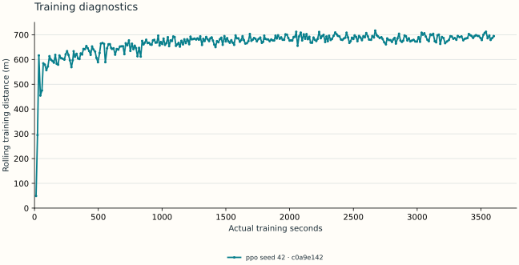
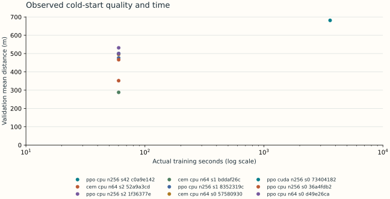
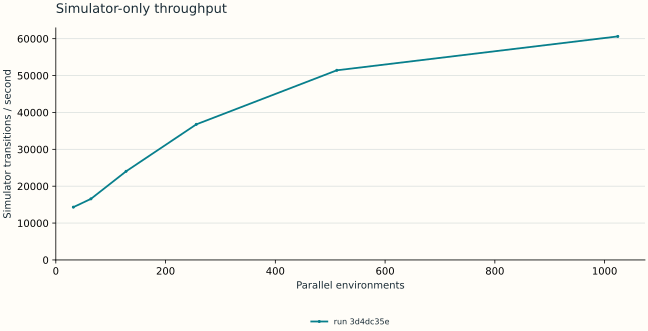

# GradientClimb research report

**Status: active research; real-game qualification incomplete.**

## Abstract and research status

GradientClimb measures how control quality changes with training time, experience, compute and prior knowledge. The current evidence establishes learning in an original uncalibrated simulator. Real-game qualification remains incomplete. The selected one-hour record is c0a9e142-1ad6-4d88-810d-bda4ca297f40 (running).

## Provisional surrogate trainer

PPO on CPU with 256 environments is the provisional choice from the replicated runtime screen. It had higher observed average validation distance and lower between-training-seed variability than the implemented CEM comparator. The table below retains all conditions and source runs. Three training seeds do not establish broad algorithm superiority, and this choice does not select a qualified real-game model.

## Experimental environment and methods

Hill Climb Racing is the first intended real testbed. Simulator metres are nominal surrogate units. The two-contact vehicle surrogate models suspension, traction, braking/reverse, airborne pitch, fuel and termination. Four joint pedal states 00/10/01/11 remain available. PPO uses independent Bernoulli pedals and a 24-feature, four-frame stacked MLP by default (96→64→64; 10,563 actor/critic parameters). CEM searches a 100-parameter linear joint-state controller on two fixed training seeds. Source: src/gradientclimb/simulation/hill.py and src/gradientclimb/algorithms/. No proprietary dynamics or game assets are redistributed.

## Training clock and statistical protocol

Actual monotonic training time includes environment/model/optimizer initialization, collection, updates, logging and checkpoint callbacks. Python imports/provenance setup and offline evaluation are outside that clock. Final serialization can create a small recorded overshoot. Validation episodes use seeds 10000–10019 in the runtime screen. Between-seed SD is computed across independently trained policies; episode bootstrap intervals condition on one policy and cannot substitute for training replicates. Model/runtime selection used validation results, so these are not untouched final-test results. Cold starts and runs with parent weights remain separate.

## Recorded workstation

Detailed machine inventory: docs/operations/workstation.md. Device capability alone is not evidence of faster learning.

| Field | Value |
| --- | --- |
| CPU | Intel64 Family 6 Model 183 Stepping 1, GenuineIntel |
| Physical / logical cores | 24 / 32 |
| RAM GiB | 63.71 |
| GPU | NVIDIA GeForce RTX 4090 Laptop GPU |
| Python | 3.13.5 |
| Frameworks | {"duckdb": "1.5.5", "gradientclimb": "0.1.0a1", "gymnasium": "1.3.0", "numpy": "2.5.3", "psutil": "7.2.2", "pyarrow": "25.0.1", "pydantic": "2.13.5", "torch": "2.11.0+cu128"} |

## Runtime and algorithm pilots

Exploratory 60-second budgets. Three seeds support a provisional engineering choice, not a broad superiority claim. CPU64 and CUDA256 each have one runtime-screen seed.

| Condition | Seeds | Mean distance m | Seed SD m | Transitions/s | Source runs |
| --- | --- | --- | --- | --- | --- |
| cem / cpu / 64 envs | 2, 1, 0 | 378.49 | 106.31 | 19,713 | 52a9a3cd-a16e-440a-ae13-e1d04bae1997, bddaf26c-ef4a-43fb-bfe6-d96e59a162f2, 57580930-1056-4baa-99ab-959a781fd1a0 |
| ppo / cpu / 256 envs | 2, 1, 0 | 491.38 | 35.08 | 8,523 | 1f36377e-af40-41ec-b075-25aa6612be04, 8352319c-e6e7-499d-b2d0-de43f90dafe2, 36a4fdb2-4c30-47a8-a980-0f3a302a20fa |
| ppo / cuda / 256 envs | 0 | 500.34 | not yet measured | 5,771 | 73404182-aee7-4618-b45d-3b9dddad30c2 |
| ppo / cpu / 64 envs | 0 | 499.95 | not yet measured | 5,149 | d49e26ca-4389-4321-88f8-8e0fac21e585 |

## Development/search compute

Runtime-screen requested budgets total 480.0 s; actual recorded training clocks total 481.36 s. These are prior development/search costs, not part of the governed one-hour cold-start session. Baseline evaluation, lightweight reporting and screenshot labeling occurred on the shared workstation during the main session; concurrent activity and thermal state limit causal hardware comparisons.

## One-hour scheduled checkpoint measurements

Scheduled rows require a matching declared parent run and checkpoint evaluation. Missing measurements stay missing. A final checkpoint score is never copied into an earlier time point. These results, when present, concern the surrogate and do not qualify real-game competence.

| Requested min | Actual training s | Mean m | Median m | Best m | Status | Evaluation run / checkpoint SHA-256 |
| --- | --- | --- | --- | --- | --- | --- |
| 5 | not yet measured | not yet measured | not yet measured | not yet measured | not yet measured | — / — |
| 10 | not yet measured | not yet measured | not yet measured | not yet measured | not yet measured | — / — |
| 20 | not yet measured | not yet measured | not yet measured | not yet measured | not yet measured | — / — |
| 30 | not yet measured | not yet measured | not yet measured | not yet measured | not yet measured | — / — |
| 45 | not yet measured | not yet measured | not yet measured | not yet measured | not yet measured | — / — |
| 60 | not yet measured | not yet measured | not yet measured | not yet measured | not yet measured | — / — |

## Learning curves

The plotted rolling mean covers the last 100 completed training episodes collected by changing stochastic policies. It is a training diagnostic, distinct from fixed-policy offline checkpoint evaluation. The source metric is mean_episode_distance, with training_elapsed_seconds from each canonical metric row.

## Training diagnostics

## Observed efficiency frontier

The plot compares completed cold-start policies by actual training duration and validation quality. Experience counts remain separately inspectable in the JSON snapshot. The observed nondominated set minimizes time and transitions while maximizing mean distance; it ignores uncertainty and is descriptive, not a statistically established frontier. Parent-weight adaptation and extended runs are excluded from this cold-start comparison.

## Quality versus training time

## Simulator throughput

Includes environment stepping and random action generation; excludes policy inference and optimization. Each condition follows 10 warm-up steps. Source runs: 3d4dc35e-25c1-4671-8e8b-5c9bb150ac6c

## Recorded simulator baselines

Random and always-gas policies are explicit baselines. Discovery-only real-game observations are excluded.

| Baseline | Run | Mean m | Median m | Episodes | Protocol |
| --- | --- | --- | --- | --- | --- |
| always_gas | 5235fad7-9d8f-4713-bb8b-1a58029020dd | 35.37 | 35.45 | 20 | held-out-surrogate-test-0.1 |
| random | f015c7ca-d1bd-4c8a-bfa9-1a4c2c8877c5 | 29.18 | 20.89 | 20 | held-out-surrogate-test-0.1 |

## Vehicle/map generalization

Not yet measured when no rows are present. Synthetic heavy/rough shifts do not establish generalization to commercial-game vehicles/maps.

Not yet measured.

## Adaptation and extended training

No adaptation speed or forgetting claim is made without paired parent/child evaluations on identical source conditions and seeds. Proposed 5/10/30/60-minute adaptation and two-epoch, single-frame and randomization ablations are defined in experiments/definitions/ and remain pending unless corresponding canonical records exist.

Not yet measured.

## Actual-window capture measurements

These are exploratory API capture-loop measurements, not the game's new-frame rate or display-to-observation latency. The PNG-recording pipeline includes encoding and writing work absent from unrecorded runs. Menu and paused scenes were not matched across the initial trials, per-run scene labels were not recorded, and CPU training was active. One trial per backend/condition does not establish backend superiority. Source frame identifiers, source-dropped frames and GPU impact remain unavailable.

| Backend / recording | Resolution | Frames | Elapsed s | Capture-loop FPS | API mean / p95 ms | Concurrent training | Run |
| --- | --- | --- | --- | --- | --- | --- | --- |
| mss / unrecorded | 2581 × 1449 | 30 | 4.53 | 6.62 | 149.61 / 177.23 | True | f01e0cd8-735d-4dae-a4d0-c9ff3e77b027 |
| dxcam / unrecorded | 2581 × 1449 | 60 | 5.10 | 11.76 | 83.52 / 211.44 | True | d6a08878-ef13-4924-987d-1416a9e0cfbd |
| pillow / unrecorded | 2581 × 1449 | 30 | 6.66 | 4.50 | 220.80 / 244.13 | True | a81a6a9c-2595-459b-9468-443b436b65fb |
| mss / PNG | 2581 × 1449 | 60 | 32.78 | 1.83 | 149.55 / 183.32 | True | e003676b-714f-4555-92c8-801d9ba6283a |

## Recorded input attempts and pixel trajectories

These are scripted diagnostic probes, not learned-policy episodes. A completed status means the bounded input schedule finished. Windows input delivery does not establish game acknowledgement; captured coasting does not confirm controlled dynamics. Requested input traces and pixels alone establish neither control competence nor transfer.

| Run | Status | Recorded frames | Observed s | Reason |
| --- | --- | --- | --- | --- |
| 06de2765-9d1f-4b5c-92e7-fcd0f8b632e8 | failed | 0 | not yet measured | capture/control failure |
| 7b8d80e5-16b3-43e6-afe2-76521c19ae9b | failed | 9 | 1.70 | playing/freshness/operator/recording guard stopped probe |
| 55c8b960-be08-403c-b5d5-5e272da32fff | failed | 8 | 1.43 | playing/freshness/operator/recording guard stopped probe |
| cf88e319-fba1-4b4b-adf2-1bc6aeb2abb8 | completed | 38 | 7.99 | bounded schedule completed |
| 873c6d2a-54fc-40f3-a5f4-3e8148c30a7b | completed | 38 | 8.22 | bounded schedule completed |
| ac68937c-f5c2-442b-b4d5-f49c4f6e4df1 | completed | 35 | 7.67 | bounded schedule completed |

## Pixel measurement pipeline

Heuristic support counts describe output availability. They are not localization, orientation or generalization accuracy; those require independent labels and their recorded evaluation.

| Run | Source frames | Wheel-supported frames | Camera-supported intervals | Held-out evaluation recorded |
| --- | --- | --- | --- | --- |
| 20ab0566-bd37-4064-9757-933664dd644e | 35 | 24 | 0 | False |
| bdf76f15-5b08-48d2-a223-1b92d8ec5278 | 35 | 27 | 0 | False |
| b2ba1612-38e9-49f8-b87c-b0dedd47bdd8 | 35 | 31 | 13 | False |

## Real-game integration, perception and transfer

Real-game qualification remains incomplete. An observed no-deliberate-input episode ended at 26 m; it was discovery only, with imprecise timing, and is not a random-policy baseline. Five actual screenshots were used to construct five templates; self-matching those same images is a construction check, not held-out accuracy. The corrected non-episodic source is b978c7e7-a4ff-40ae-a1bd-2577ea935010. Prior record b5a1748c-0fb1-4787-9d05-a077fd2c5443 had an episode-metadata defect and is excluded from analytical evidence. Both refer to the same five images, not ten. See docs/operations/game-discovery.md. Capture and probe measurements above update with canonical records; neither alone establishes calibrated dynamics, unattended real-game competence, real adaptation or a sim-to-real performance ratio. Input-tool interruptions are operational states, not permanent scientific conclusions.

## Negative results and limitations

The CUDA256 pilot executed fewer transitions than CPU256 for this small policy and CPU simulator. CEM seed0 looked competitive, but its replicated results were more variable; fitting two fixed training seeds is a material limitation. Architecture, observation history and optimizer all differ between PPO and CEM, so this comparison does not isolate a single causal component. PPO epoch work can vary due to the approximate-KL stop. Uncalibrated state observations, simple terrain families and finite episode horizons limit transfer claims. Native-game safety and perception must be validated before interpreting simulator scores as real competence.

## Reproducibility and source integrity

Generated from canonical run records and journals. Evidence cutoff: 2026-09-11T18:21:34.790353+00:00. Verification: full sealed artifact check. Active records are explicitly unsealed and may have different per-file cutoffs. Every source snapshot, configuration/source identifier and checkpoint hash is retained in results-summary.json. Refresh with python scripts/analyze_research.py --root artifacts; use --verify after serious runs finish to recheck all sealed artifacts. Literature: research/literature/README.md. Governing protocol: docs/methodology/qualification.md.

## Source run index

| Run | Experiment | Status | Git SHA | Dirty | Checkpoint SHA-256 |
| --- | --- | --- | --- | --- | --- |
| 06de2765-9d1f-4b5c-92e7-fcd0f8b632e8 | real-control-probe | failed | 267d0ac227a8392b86c6e0386147167de591c3b7 | True | — |
| 7b8d80e5-16b3-43e6-afe2-76521c19ae9b | real-control-probe | failed | 267d0ac227a8392b86c6e0386147167de591c3b7 | True | — |
| 55c8b960-be08-403c-b5d5-5e272da32fff | real-control-probe | failed | 267d0ac227a8392b86c6e0386147167de591c3b7 | True | — |
| 74f6c15c-013d-48e2-af51-12bc95d084bf | hud-independent-probe-check | completed | 267d0ac227a8392b86c6e0386147167de591c3b7 | True | — |
| ae953116-cd5f-4f47-8313-d7350e36001a | hud-glyph-completion | completed | 267d0ac227a8392b86c6e0386147167de591c3b7 | True | — |
| bf79e106-ec25-47f2-89ab-9f91184f5f55 | fixed-template-native-check | completed | 267d0ac227a8392b86c6e0386147167de591c3b7 | True | — |
| 20ab0566-bd37-4064-9757-933664dd644e | offline-game-pixel-measurements | completed | 267d0ac227a8392b86c6e0386147167de591c3b7 | True | — |
| cf88e319-fba1-4b4b-adf2-1bc6aeb2abb8 | real-control-probe | completed | 267d0ac227a8392b86c6e0386147167de591c3b7 | True | — |
| bdf76f15-5b08-48d2-a223-1b92d8ec5278 | offline-game-pixel-measurements | completed | 267d0ac227a8392b86c6e0386147167de591c3b7 | True | — |
| 873c6d2a-54fc-40f3-a5f4-3e8148c30a7b | real-control-probe | completed | 267d0ac227a8392b86c6e0386147167de591c3b7 | True | — |
| b2ba1612-38e9-49f8-b87c-b0dedd47bdd8 | offline-game-pixel-measurements | completed | 267d0ac227a8392b86c6e0386147167de591c3b7 | True | — |
| 6fd5abdb-51e7-43a0-aecd-4cd7b9cc8298 | hud-glyph-prototypes | completed | 267d0ac227a8392b86c6e0386147167de591c3b7 | True | — |
| ac68937c-f5c2-442b-b4d5-f49c4f6e4df1 | real-control-probe | completed | 267d0ac227a8392b86c6e0386147167de591c3b7 | True | — |
| f01e0cd8-735d-4dae-a4d0-c9ff3e77b027 | screen-capture-benchmark | completed | 267d0ac227a8392b86c6e0386147167de591c3b7 | True | — |
| d6a08878-ef13-4924-987d-1416a9e0cfbd | screen-capture-benchmark | completed | 267d0ac227a8392b86c6e0386147167de591c3b7 | True | — |
| a81a6a9c-2595-459b-9468-443b436b65fb | screen-capture-benchmark | completed | 267d0ac227a8392b86c6e0386147167de591c3b7 | False | — |
| e003676b-714f-4555-92c8-801d9ba6283a | screen-capture-benchmark | completed | 267d0ac227a8392b86c6e0386147167de591c3b7 | False | — |
| 5235fad7-9d8f-4713-bb8b-1a58029020dd | surrogate-evaluation | completed | 73c5ea2ec6864a90ec15c8b0b209287507da5bd7 | True | — |
| f015c7ca-d1bd-4c8a-bfa9-1a4c2c8877c5 | surrogate-evaluation | completed | 73c5ea2ec6864a90ec15c8b0b209287507da5bd7 | True | — |
| b978c7e7-a4ff-40ae-a1bd-2577ea935010 | real-game-discovery-labels | completed | 73c5ea2ec6864a90ec15c8b0b209287507da5bd7 | True | — |
| b5a1748c-0fb1-4787-9d05-a077fd2c5443 | real-game-discovery-labels | completed | 73c5ea2ec6864a90ec15c8b0b209287507da5bd7 | False | — |
| c0a9e142-1ad6-4d88-810d-bda4ca297f40 | one-hour-surrogate | running | 73c5ea2ec6864a90ec15c8b0b209287507da5bd7 | False | — |
| 52a9a3cd-a16e-440a-ae13-e1d04bae1997 | runtime-screen | completed | b7ca30e1d9f43e701db797f73fc27d7c96f59f98 | True | d7426ca85cb4ac34b46798113ad79849a365b27d5b4ff24286289f6c8a899bcd |
| 1f36377e-af40-41ec-b075-25aa6612be04 | runtime-screen | completed | b7ca30e1d9f43e701db797f73fc27d7c96f59f98 | True | d38d6ce658274bc242845d105508177d9a64cf87d70b651b5898c4ef252778fd |
| bddaf26c-ef4a-43fb-bfe6-d96e59a162f2 | runtime-screen | completed | b7ca30e1d9f43e701db797f73fc27d7c96f59f98 | True | 196a4ad92f68f4d1379ff7941e21805c3e1b79e9aceb6ad1aff9644f7bcb496e |
| 8352319c-e6e7-499d-b2d0-de43f90dafe2 | runtime-screen | completed | b7ca30e1d9f43e701db797f73fc27d7c96f59f98 | True | e8e6f5bc83b98ef6551b6d9457f1a56abb353e93cc85cd2d18c7b7d0b0c02efd |
| 57580930-1056-4baa-99ab-959a781fd1a0 | runtime-screen | completed | b7ca30e1d9f43e701db797f73fc27d7c96f59f98 | True | 02365f33d8125d7eed867103a1d0cc896a1d40d191baab005cdfbe050a8799c9 |
| 73404182-aee7-4618-b45d-3b9dddad30c2 | runtime-screen | completed | b7ca30e1d9f43e701db797f73fc27d7c96f59f98 | True | a9631cb54ffeccacaaa5ca21aa48bf2193b17e4ce22c89428f1eef87925c8ee1 |
| 36a4fdb2-4c30-47a8-a980-0f3a302a20fa | runtime-screen | completed | b7ca30e1d9f43e701db797f73fc27d7c96f59f98 | True | 9341c73fc092c8616297bb8a60af85ca3bd51075522430e6afc0b4859ea2bd91 |
| d49e26ca-4389-4321-88f8-8e0fac21e585 | runtime-screen | completed | b7ca30e1d9f43e701db797f73fc27d7c96f59f98 | True | 355ff055d25e99444fb30ba585371f652079fb0b24621e1b412ee8b4ba5fdab2 |
| 3d4dc35e-25c1-4671-8e8b-5c9bb150ac6c | simulation-throughput | completed | b7ca30e1d9f43e701db797f73fc27d7c96f59f98 | True | — |
| 1597ae82-8b23-42f2-843f-af05b55b8824 | synthetic-convergence | completed | b7ca30e1d9f43e701db797f73fc27d7c96f59f98 | True | 50fc8b4f63af4f899cfc966608ae942021101ae0f14da24f8de99b936bf84aa8 |
| 0223be43-5a3b-4205-8713-d7c4e7791e98 | synthetic-convergence | completed | b7ca30e1d9f43e701db797f73fc27d7c96f59f98 | True | abb61d96233beb6599706557867fead3988b07596a9152eb81ee6a10be7ee317 |
